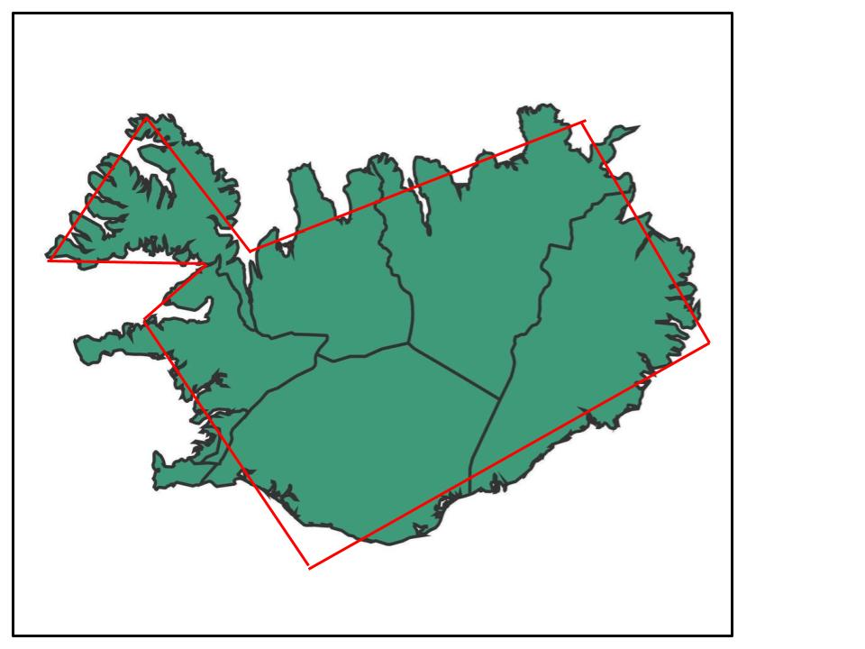
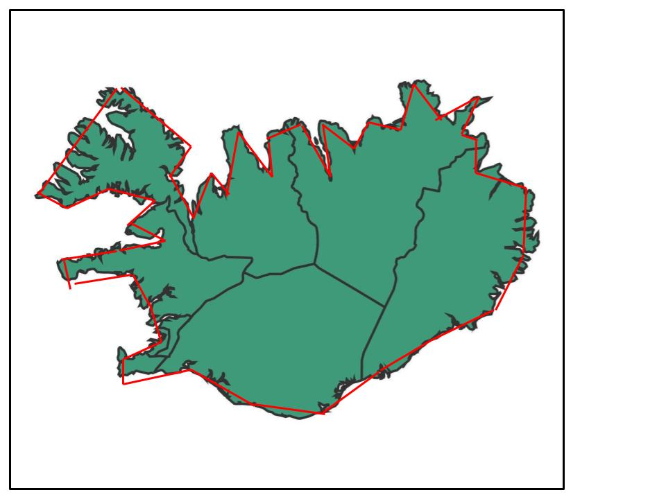
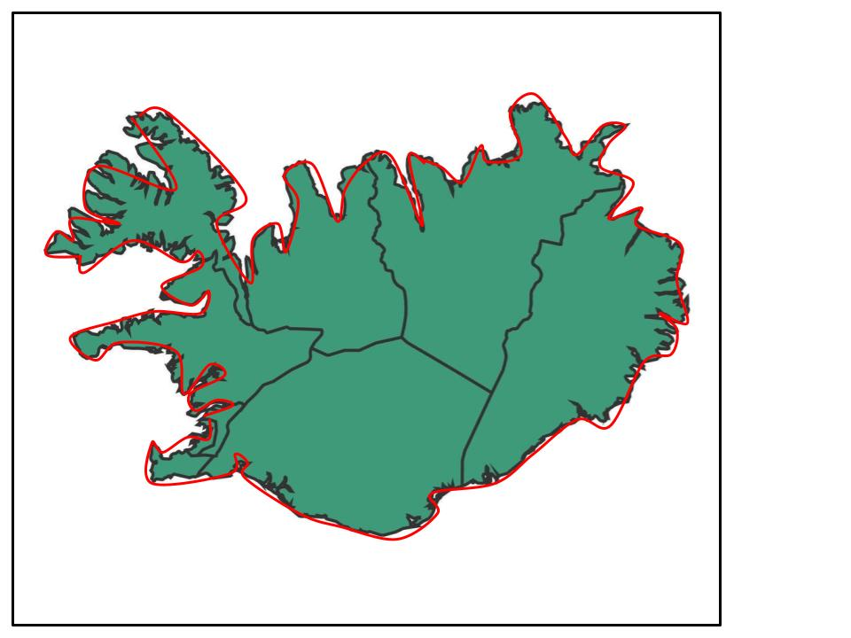
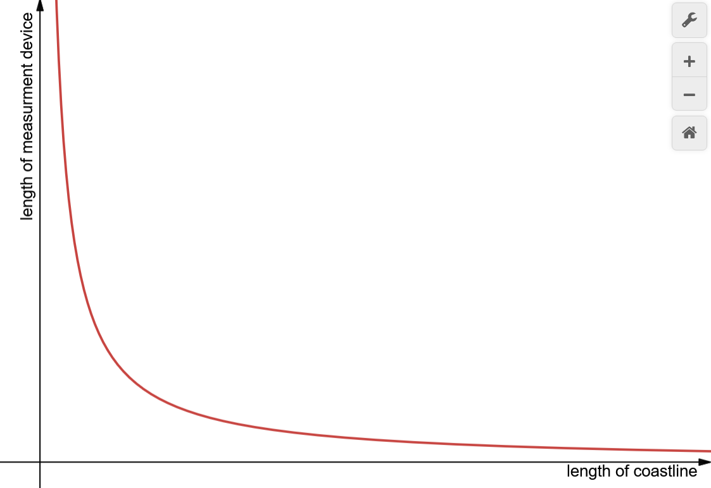
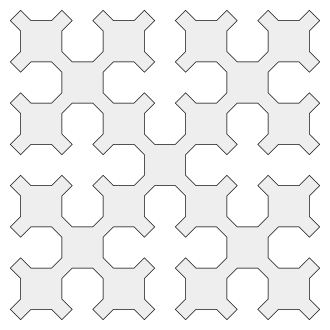
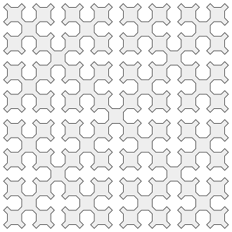
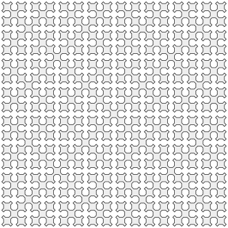
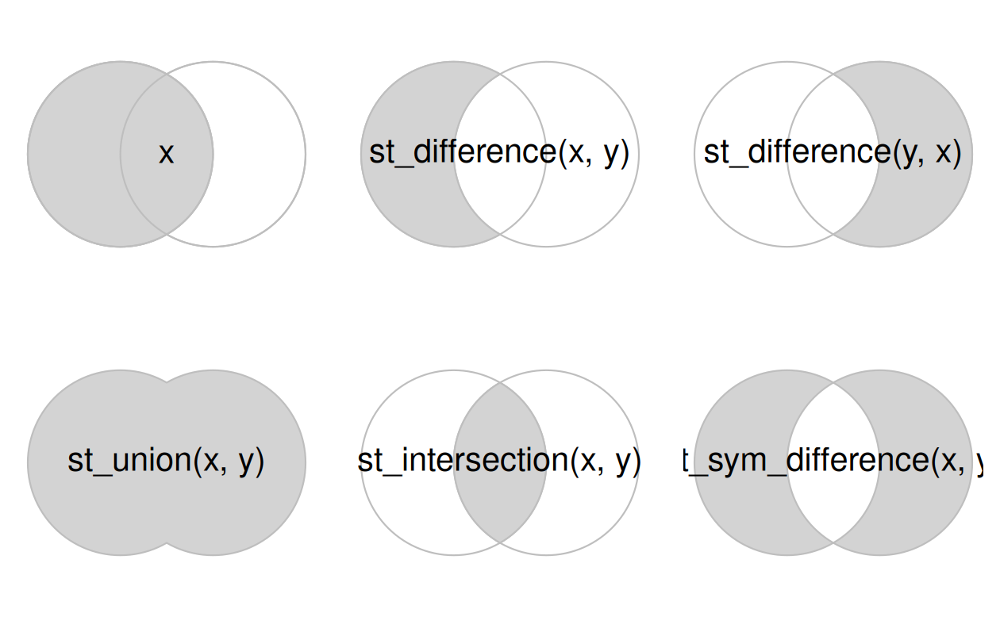

# Introduction

Main reference for these notes is Lovelace, R., Nowosad, J. and Muenchow, J., 2019. Geocomputation with R. Chapman and Hall/CRC. [https://r.geocompx.org/geometry-operations](Chapter 5: Geometry Operations)

This chapter, quote: "...focuses on manipulating the geographic elements of spatial objects." This includes:

  * **Simplification**: reducing memory size by reducing geometries 
  * **Centroids**: calculating the center of mass of a geometry object
  * **Buffers**:  generate buffer zones surrounding a geometry
  * **Casting**: transform between geometry types
  * **Clipping**:  restricting geometry space b/w two objects
  * **Distances**: calculating distance b/w one or two geometry objects
  * **Transformations**: shifting, scaling, and rotations
  
style="color:blue">**Geometry Operations**</span> are manipulations of vector data that <u>manipulates its geometry</u>.
  
Here are the main libraries we will use for these notes:

``` {r libraries, output='hide'}
library(sf)           # simple-features library
library(terra)        # spatial data analysis
library(tidyverse)    # tidyverse: data manipulation, ggplot
library(spData)       # gives us example spatial datasets
library(spDataLarge)  # gives us example large spatial datasets
library(patchwork)    # put ggplots side-by-side
library(rmapshaper)   # for ms_simplify()
library(smoothr)      # for smooth()
```

# 1. Simplification

## Motivation: Coastline Paradox

Let's say you're trying to measure the length of coastline of a nation, say Iceland. Further, imagine that we are measuring the coastline using a <u>500km</u> ruler. The resulting measurement will be quite inaccurate, much lower than the true coastline length since we cannot account for small edges and turns. 

Then, we use a <u>100km</u> ruler to measure the coastline and obtain a new measurement, which is still inaccurate, but our measured coastline value has now increased as our margin of error decreases as we are able to account for more details of the curves around the coastline.

Now imagine this measurement process iteratively: 

**500km** -> **100km** -> **10km** -> **1km** -> .... -> tracing around every **pebble** and **grain of sand** -> ... -> tracing around every **Planck length** of matter. 

What do we think happens to the value we obtain for the coastline? 

Essentially, the length of our coastline approaches *infinity* as our our measurement device records smaller and smaller values. This result is obviously impossible, since the length of a coastline has to be a finite value. Thus, we arrive at the **Coastline Paradox**, first noted by Lewis Fry Richardson in the 1920s.

::: {layout-ncol=3}





:::

Put in more formal terms, where $n$ is the length of our measurement device, and the function $f(n) = \frac{1}{n}$ gives us the basic inverse relationship between coastline length and length of measurement device:

$$
\lim_{n \rightarrow 0} \frac{1}{n} = \infty
$$

::: {layout-ncol=1}

:::

The reason for this phenomena is **fractals**: if we start very zoomed out, everything looks quite "smooth", and we see the outline of bays and peninsulas. As we zoom in further, we see that each bay as its own inlet; even further, that each inlet has rocky shorelines; further, each individual rock has crevices; sand grains have irregular edges; and so forth.

:::{layout-ncol=5}







:::


Theoretically, our measurement devices are capable of approaching measuring lengths $\rightarrow 0$. However, in reality this is not possible nor feasible; as some point, the measurements would flatten enough where even smaller measurements would not affect the length of the coastline at some significance level. Further, it not physically possible to create measuring devices of such a microscopic scale.

What does this paradox have to do with our geospatial data? 

When computing spatial geometries, these types of geometries & their associated calculations can take up a lot of memory in exchange for very precise maps. Thus, we might want to take a extremely precise map, measured with very 'small' measuring sticks, and scale it back to a more inaccurate map, in exchange for more memory storage. 

Indeed, we can see from Euclidean geometry that the length of a curve can be approximated using straight lines that connecting various points on the curve. Although not the exact arc length of our curve, this approximation helps us to build 'shortcuts' where we sacrifice super precise representations of our maps/geometries in exchange for way more computational power. Of course, this trade-off must be balanced; we still need to accurately represent our maps to an audience and not risk losing too many data points from our simplification process.


This leads us into our first *unary* operator (works on a single geometry in isolation): **Simplification**.

Found in the `sf` package, our function of choice here is `sf_simplify()`.

## Seine Example

For example, we can see below how the `sf_simplify()` function reduces the complexity of the map of the rivers in France:

```{r seine simplification}
# st_simplify with 2000m 'measuring stick'
seine_simple <- st_simplify(seine, dTolerance = 2000) # 2000m
```


```{r sf_simplify seine plot}
#| code-fold: true
#| code-summary: "Show plotting code"
# here we use the sf library to access the geom df `seine`

# original data
p1 <- ggplot() +
  geom_sf(data=seine, color = "black", linewidth=0.65) +
  labs(title = "Original Data") +
  theme(
    panel.background = element_rect(fill=NA),
    panel.border = element_rect(color = "black", fill = NA, linewidth = 0.8),
    panel.grid.major = element_blank(),
    panel.grid.minor = element_blank(),
    axis.text = element_blank(),
    axis.ticks = element_blank(),
    axis.title = element_blank(),
    plot.title = element_text(size = 16, hjust = 0.5)
  )

# simplified data
p2 <- ggplot() +
  geom_sf(data=seine_simple, color = "black", linewidth=0.65) +
  labs(title = "st_simplify()") +
  theme(
    panel.background = element_rect(fill=NA),
    panel.border = element_rect(color = "black", fill = NA, linewidth = 0.8),
    panel.grid.major = element_blank(),
    panel.grid.minor = element_blank(),
    axis.text = element_blank(),
    axis.ticks = element_blank(),
    axis.title = element_blank(),
    plot.title = element_text(size = 16, hjust = 0.5)
  )

p1 + p2
```

As we can see, after using `st_simplify` our graph has much less complexity, with fewer vertices. We can verify that it is computationally friendlier as a result:

```{r st_simplify bytes}
# memory usage of og data
object.size(seine)
# memory usage of simplified data
object.size(seine_simple)
```

Note the makeup of the `st_simplify` function is very simple:

st_simplify(`x` = *sfg*, *sfc*, or *sf* object,
            `preserveTopology` = *logical*,
            `dTolerance` = *numeric*)
            
Where:

  * `preserveTopology`: logical, default is `TRUE`; asks whether to avoid invalid geometries (self-intersections, border crossings, etc). `TRUE` is much safer, more conservative; `FALSE` simplifies as much as possible, but allows for weird occurances in the geometry.
  * `dTolerance`: numeric; controls for how simplified we want our graph. Lower value corresponds to preserving the original geometry; higher values simplify the graphs more and more. Can think of this as the 'length' of our new measuring stick we want to use.

## US States Example

```{r st_simplify us_states}
# st_simplify polygons using 1000km 'measuring stick'
us_states_simple <- st_simplify(us_states, dTolerance = 100000) # 1000km
```

We can demonstrate this again, this time using polygons rather than linestrings.

```{r st_simplify us_states plots}
#| code-fold: true
#| code-summary: "Show plotting code"

# plot 1: no change
p1 <- ggplot() +
  geom_sf(data=us_states, color = "black", linewidth=0.65) +
  labs(title = "Original Data") +
  theme(
    panel.background = element_rect(fill=NA),
    panel.border = element_rect(color = "black", fill = NA, linewidth = 0.8),
    panel.grid.major = element_blank(),
    panel.grid.minor = element_blank(),
    axis.text = element_blank(),
    axis.ticks = element_blank(),
    axis.title = element_blank(),
    plot.title = element_text(size = 16, hjust = 0.5)
  )

# plot 2: after st_simplify()
p2 <- ggplot() +
  geom_sf(data=us_states_simple, color = "black", linewidth=0.65) +
  labs(title = "st_simplify()") +
  theme(
    panel.background = element_rect(fill=NA),
    panel.border = element_rect(color = "black", fill = NA, linewidth = 0.8),
    panel.grid.major = element_blank(),
    panel.grid.minor = element_blank(),
    axis.text = element_blank(),
    axis.ticks = element_blank(),
    axis.title = element_blank(),
    plot.title = element_text(size = 16, hjust = 0.5)
  )

p1 + p2
```

Notice an issue here with this simplification: `st_simplify` simplifies objects on a *per-geometry* basis; i.e., it leads to overlapping and "holey" areal units, such as in our graph above.

A possible solution to this problem with polygons is to use other functions, such as `ms_simplify()` or `smooth()`:

```{r}
# ms_simplify()
us_states_ms_simple <- ms_simplify(us_states, keep=0.1, keep_shapes=TRUE)

# smooth()
us_states_smooth <- smooth(us_states, method = "ksmooth", smoothness = 6)
```

```{r ms_simplify smooth}
#| code-fold: true
#| code-summary: "Show plotting code"
#| 
# ms_simplify() plot
p1 <- ggplot() +
  geom_sf(data=us_states_ms_simple, color = "black", linewidth=0.65) +
  labs(title = "ms_simplify()") +
  theme(
    panel.background = element_rect(fill=NA),
    panel.border = element_rect(color = "black", fill = NA, linewidth = 0.8),
    panel.grid.major = element_blank(),
    panel.grid.minor = element_blank(),
    axis.text = element_blank(),
    axis.ticks = element_blank(),
    axis.title = element_blank(),
    plot.title = element_text(size = 16, hjust = 0.5)
  )

# smooth() plot
p2 <- ggplot() +
  geom_sf(data=us_states_smooth, color = "black", linewidth=0.65) +
  labs(title = "smooth()") +
  theme(
    panel.background = element_rect(fill=NA),
    panel.border = element_rect(color = "black", fill = NA, linewidth = 0.8),
    panel.grid.major = element_blank(),
    panel.grid.minor = element_blank(),
    axis.text = element_blank(),
    axis.ticks = element_blank(),
    axis.title = element_blank(),
    plot.title = element_text(size = 16, hjust = 0.5)
  )

p1 + p2
```

Note that the `smooth()` function does not preserve topology similar to `st_simplify()`, but is useful when working with geometries that arise from spatially vectorizing a raster.

# 2. Centroids

Centroid operations identify the center of a geographic object. Although there are many ways to define a 'geometric center,' the most common method is the **geographic centroid** (referred to simply as a centroid). They represent the center of mass in a spatial object; imagine balancing a plate on your finger. This unary operator is applied using the function `sf_centroid()`. For example,

```{r centroids us_states seine object}
us_states_centroid <- st_centroid(us_states)
seine_centroids <- st_centroid(seine)
```

```{r centroids us_states seine plot}
#| code-fold: true
#| code-summary: "Show plotting code"
#| 
# st_centroid() plot
p1 <- ggplot() +
  geom_sf(data=us_states) +
  geom_sf(data=us_states_centroid, color = "black", shape=24, fill = "blue") +
  labs(title = "st_centroid()") +
  theme(
    panel.background = element_rect(fill=NA),
    panel.border = element_rect(color = "black", fill = NA, linewidth = 0.8),
    panel.grid.major = element_blank(),
    panel.grid.minor = element_blank(),
    axis.text = element_blank(),
    axis.ticks = element_blank(),
    axis.title = element_blank(),
    plot.title = element_text(size = 16, hjust = 0.5)
  )

p2 <- ggplot() +
  geom_sf(data=seine) +
  geom_sf(data=seine_centroids, color = "black", linewidth=0.65, shape=24, fill = "blue") +
  labs(title = "st_centroid()") +
  theme(
    panel.background = element_rect(fill=NA),
    panel.border = element_rect(color = "black", fill = NA, linewidth = 0.8),
    panel.grid.major = element_blank(),
    panel.grid.minor = element_blank(),
    axis.text = element_blank(),
    axis.ticks = element_blank(),
    axis.title = element_blank(),
    plot.title = element_text(size = 16, hjust = 0.5)
  )

p1 + p2
```

Note that some of the centroids can actually lie *outside* of the boundaries of their parent objects! In such cases, we can use `st_point_on_surface()` to guaranetee the point will be in the parent object. 

```{r st_point_on_surface us_states seine objects}
us_states_st_surface_pt <- st_point_on_surface(us_states)
seine_st_surface_pt <- st_point_on_surface(seine)
```


```{r centroids us_states seine plots}
#| code-fold: true
#| code-summary: "Show plotting code"
#| 
# st_centroid() plot
p1 <- ggplot() +
  geom_sf(data=us_states) +
  geom_sf(data=us_states_st_surface_pt, color = "black", shape=24, fill = "blue") +
  labs(title = "st_point_on_surface()") +
  theme(
    panel.background = element_rect(fill=NA),
    panel.border = element_rect(color = "black", fill = NA, linewidth = 0.8),
    panel.grid.major = element_blank(),
    panel.grid.minor = element_blank(),
    axis.text = element_blank(),
    axis.ticks = element_blank(),
    axis.title = element_blank(),
    plot.title = element_text(size = 16, hjust = 0.5)
  )

p2 <- ggplot() +
  geom_sf(data=seine) +
  geom_sf(data=seine_st_surface_pt, color = "black", linewidth=0.65, shape=24, fill = "blue") +
  labs(title = "st_point_on_surface()") +
  theme(
    panel.background = element_rect(fill=NA),
    panel.border = element_rect(color = "black", fill = NA, linewidth = 0.8),
    panel.grid.major = element_blank(),
    panel.grid.minor = element_blank(),
    axis.text = element_blank(),
    axis.ticks = element_blank(),
    axis.title = element_blank(),
    plot.title = element_text(size = 16, hjust = 0.5)
  )

p1 + p2
```

# 3. Buffers

**Buffers** are polygons that represent the area within a given distance of a geometric feature. No matter the input (pt, line, polygon), the output is always a polygon. Can be used for geographic data analysis (e.g. How many pts are within a given distance of this line? Which demographic groups are within travelling distance of this new coffee shop?... etc).

We can utilize the `st_buffer()` function to implement these unary geometry operations:

```{r seine st_buffer objects}
# st_buffer() 5km
seine_buff_5km <- st_buffer(seine, dist = 5000)
# st_buffer() 50km
seine_buff_50km <- st_buffer(seine, dist = 50000)
```

```{r sein buffer plots}
#| code-fold: true
#| code-summary: "Show plotting code"
#| 
# st_buffer() 5km plot
p1 <- ggplot() +
  geom_sf(data=seine_buff_5km, color = "black", linewidth=0.5,  aes(fill = name)) +
  geom_sf(data=seine, linewidth=0.65) +
  labs(title = "st_buffer() 5km") +
  scale_fill_manual(values = c("salmon1", "skyblue3", "goldenrod1")) +
  theme(
    panel.background = element_rect(fill=NA),
    panel.border = element_rect(color = "black", fill = NA, linewidth = 0.8),
    panel.grid.major = element_blank(),
    panel.grid.minor = element_blank(),
    axis.text = element_blank(),
    axis.ticks = element_blank(),
    axis.title = element_blank(),
    plot.title = element_text(size = 16, hjust = 0.5),
    legend.position = "none"
  )

# st_buffer() 50km plot
p2 <- ggplot() +
  geom_sf(data=seine_buff_50km, color = "black", linewidth=0.5, aes(fill = name)) +
  geom_sf(data=seine, linewidth=0.65) +
  labs(title = "st_buffer() 50km",
       fill = "Rivers") +
  scale_fill_manual(values = c("salmon1", "skyblue3", "goldenrod1")) +
  theme(
    panel.background = element_rect(fill=NA),
    panel.border = element_rect(color = "black", fill = NA, linewidth = 0.8),
    panel.grid.major = element_blank(),
    panel.grid.minor = element_blank(),
    axis.text = element_blank(),
    axis.ticks = element_blank(),
    axis.title = element_blank(),
    plot.title = element_text(size = 16, hjust = 0.5)
  )
help(st_buffer)
p1 + p2
```

Note that `st_buffer()` has the following arguments:

st_buffer(`x` = *sf*, *sfc*, *sfg*,
          `dist` = numeric,`
          `nQuadSegs` = numeric,
          `max_cells` = numeric,
          `endCapStyle` = string,
          `joinStyle` = string,
          `singleSide` = logical)
          
Where:

  * `dist`: distance of the buffer polygon surrounding the object. Note that the units provided must match the units of the CRS.
  * `nQuadSegs`: number of segments per quadrant. Default is 30, where circles created by buffers are composed of $4 \cdot 30 = 120$ lines. Edge cases where it may be useful to adjust is when memory consumed by a buffer operation is of concern (in which case we would reduce the value) or when we want very high precision (in which case we would increase the value).
  * `max_cells`: larger value corresponds to a smoother buffer, but at the cost of longer calculations
  * `endCapStyle`: controls the appearance of buffers' edges ("ROUND", "FLAT", "SQUARE")
  * `joinStyle`: controls the appearance of buffers' line joins ("ROUND", "MITRE", "BEVEL")
  * `singleSide`: controls whether the buffer is created on one or both sides of input geometry
  


# 4. Casting

**Casting**: to be able to transform a geometry's type into another based on its vertices. The selected function for this is `st_cast()`. For example, imagine we have a collection of pts we want to transform into a linestring or polygon:

```{r}
# set of pts
multipts.tri <- st_multipoint(matrix(c(1,3,5,1,3,1), ncol=2))
# cast as linestring object
linestring.tri <- st_cast(multipts.tri, "LINESTRING")
# cast as polygon object
polygon.tri <- st_cast(multipts.tri, "POLYGON")
```

```{r}
#| code-fold: true
#| code-summary: "Show plotting code"

p1 <- ggplot() +
  geom_sf(data=multipts.tri) +
  labs(title = "MULTIPOINT") +
  theme(
    panel.background = element_rect(fill=NA),
    panel.border = element_rect(color = "black", fill = NA, linewidth = 0.8),
    panel.grid.major = element_blank(),
    panel.grid.minor = element_blank(),
    axis.text = element_blank(),
    axis.ticks = element_blank(),
    axis.title = element_blank(),
    plot.title = element_text(size = 16, hjust = 0.5)
  )

p2 <- ggplot() +
  geom_sf(data=linestring.tri, linewidth = 0.6) +
  labs(title = "LINESTRING") +
  theme(
    panel.background = element_rect(fill=NA),
    panel.border = element_rect(color = "black", fill = NA, linewidth = 0.8),
    panel.grid.major = element_blank(),
    panel.grid.minor = element_blank(),
    axis.text = element_blank(),
    axis.ticks = element_blank(),
    axis.title = element_blank(),
    plot.title = element_text(size = 16, hjust = 0.5)
  )

p3 <- ggplot() +
  geom_sf(data=polygon.tri, linewidth = 0.6) +
  labs(title = "POLYGON") +
  theme(
    panel.background = element_rect(fill=NA),
    panel.border = element_rect(color = "black", fill = NA, linewidth = 0.8),
    panel.grid.major = element_blank(),
    panel.grid.minor = element_blank(),
    axis.text = element_blank(),
    axis.ticks = element_blank(),
    axis.title = element_blank(),
    plot.title = element_text(size = 16, hjust = 0.5)
  )

p1 + p2 + p3
```

Using our Seine example from before:

```{r}
# transform seine from LINESTRING -> MULTIPOINT
seine_cast <- st_cast(seine, 
                      to = "MULTIPOINT")
```

```{r seine plot}
#| code-fold: true
#| code-summary: "Show plotting code"

# original data
p1 <- ggplot() +
  geom_sf(data=seine, color = "black", linewidth=0.65) +
  labs(title = "LINESTRING") +
  theme(
    panel.background = element_rect(fill=NA),
    panel.border = element_rect(color = "black", fill = NA, linewidth = 0.8),
    panel.grid.major = element_blank(),
    panel.grid.minor = element_blank(),
    axis.text = element_blank(),
    axis.ticks = element_blank(),
    axis.title = element_blank(),
    plot.title = element_text(size = 16, hjust = 0.5)
  )

# multipoint casting
p2 <- ggplot() +
  geom_sf(data=seine_cast, color = "black") +
  labs(title = "MULTIPOINT") +
  theme(
    panel.background = element_rect(fill=NA),
    panel.border = element_rect(color = "black", fill = NA, linewidth = 0.8),
    panel.grid.major = element_blank(),
    panel.grid.minor = element_blank(),
    axis.text = element_blank(),
    axis.ticks = element_blank(),
    axis.title = element_blank(),
    plot.title = element_text(size = 16, hjust = 0.5)
  )

p1 + p2
```


# 5. Affine Transformations

Our last unary operator has to do with geometric **transformations** that preserve lines and parallelism. This includes, but is not limited to:

  * **Translation**
  * **Scaling**
  * **Rotation**
  
As well as any combination of these. These transformations are not done by a built-in function, but rather by using manipulation of geometry coordinates.

However, some functions will be needed to assign CRS' to our new objects, as well as replacing our old geometry with our new geometry:

  * `st_geometry`: extract only the geometry column from an `sf` object
  * `st_crs`: extract/set the crs value of an `sf` object
  * `st_set_geometry`: replace our old sfc (input 1) with our updated sfc (input 2)

## Transforming

For example, to **transform** (shift) a map of New Zealand, we can simply add values to adjust the x and y-coordinates:

```{r transformation}
# extract geom column from nz sf object
nz.sfc <- st_geometry(nz)

# shift every geom value y-value by 100000m (1000km)
nz_shift_y <- nz.sfc + c(0,100000)
st_crs(nz_shift_y) <- st_crs(nz)
nz_shift_y.sf <- st_set_geometry(nz, nz_shift_y) # assign new geoms back to og sf

# shift every geom value x-value by 50000m (500km)
nz_shift_x <- nz.sfc + c(50000,0)
st_crs(nz_shift_x) <- st_crs(nz) # set our trans geom to match our og CRS
nz_shift_x.sf <- st_set_geometry(nz, nz_shift_x)
```

```{r nz trans plot}
#| code-fold: true
#| code-summary: "Show plotting code"

ggplot() +
  geom_sf(data=nz, color = "black", linewidth=0.65, fill = "darkgray") +
  geom_sf(data=nz_shift_x.sf, color = "black", linewidth=0.65, fill="skyblue",alpha = 0.5) +
  geom_sf(data=nz_shift_y.sf, color = "black", linewidth=0.65, fill="salmon",alpha = 0.5) +
  labs(title = "TRANSFORMATION") +
  theme(
    panel.background = element_rect(fill=NA),
    panel.border = element_rect(color = "black", fill = NA, linewidth = 0.8),
    panel.grid.major = element_blank(),
    panel.grid.minor = element_blank(),
    axis.text = element_blank(),
    axis.ticks = element_blank(),
    axis.title = element_blank(),
    plot.title = element_text(size = 16, hjust = 0.5)
  )
```

## Scaling 

**Scaling** our maps involves enlarging our shrinking objects by a factor. We can adjust these scales *globally*, to affect every point in our geometry; for example,

```{r global scaling}
# shrink every geom value by 0.5
nz_global_center <- st_centroid(st_union(nz.sfc)) # GLOBAL center
nz_global_scale <- (nz.sfc - nz_global_center) * 0.5 + nz_global_center
st_crs(nz_global_scale) <- st_crs(nz)
nz_global_scale.sfc <- st_set_geometry(nz, nz_global_scale)
```

Note that to get the global centroid, we need to take union of all our geometries using the `st_union()` function, after which we can apply to it `st_centroid`.

```{r nz global scale plot}
#| code-fold: true
#| code-summary: "Show plotting code"

p1<-ggplot() +
  geom_sf(data=nz, color = "black", linewidth=0.65, fill="gray") +
  geom_sf(data=nz_global_scale.sfc, color = "black", linewidth=0.65, fill="skyblue",alpha = 0.5) +
  #geom_sf(data=nz_scale_inc.sfc, color = "black", linewidth=0.65, fill="salmon",alpha = 0.5) +
  labs(title = "GLOBAL SCALING") +
  theme(
    panel.background = element_rect(fill=NA),
    panel.border = element_rect(color = "black", fill = NA, linewidth = 0.8),
    panel.grid.major = element_blank(),
    panel.grid.minor = element_blank(),
    axis.text = element_blank(),
    axis.ticks = element_blank(),
    axis.title = element_blank(),
    plot.title = element_text(size = 16, hjust = 0.5)
  )
```

Or we can adjust these scales *locally*, treating geometries independently and requires points around which geometries are going to be scales (centroids, for example):

```{r local scaling}
# extract geom column from nz sf object
nz.sfc <- st_geometry(nz)

# shrink every geom value y-value by 0.5
nz_centroid.sfc <- st_centroid(nz.sfc) # LOCAL centers
nz_scale <- (nz.sfc - nz_centroid.sfc) * 0.5 + nz_centroid.sfc
st_crs(nz_scale) <- st_crs(nz) 
nz_scale.sfc <- st_set_geometry(nz, nz_scale)
```

```{r nz local scale plot}
#| code-fold: true
#| code-summary: "Show plotting code"

p2<-ggplot() +
  geom_sf(data=nz, color = "black", linewidth=0.65, fill = "darkgray") +
  geom_sf(data=nz_scale.sfc, color = "black", linewidth=0.65, fill="skyblue",alpha = 0.5) +
  #geom_sf(data=nz_scale_inc.sfc, color = "black", linewidth=0.65, fill="salmon",alpha = 0.5) +
  labs(title = "LOCAL SCALING") +
  theme(
    panel.background = element_rect(fill=NA),
    panel.border = element_rect(color = "black", fill = NA, linewidth = 0.8),
    panel.grid.major = element_blank(),
    panel.grid.minor = element_blank(),
    axis.text = element_blank(),
    axis.ticks = element_blank(),
    axis.title = element_blank(),
    plot.title = element_text(size = 16, hjust = 0.5)
  )

p1+p2
```

## Rotation

Finally, we can **rotate** our graphs using a rotation matrix of the following form:

$$
R = 
\begin{bmatrix}
  cos\theta & -sin\theta \\
  sin\theta & cos\theta
\end{bmatrix}
$$

Which rotates points in a clockwise direction. We can define a rotation function as the following:


```{r rotation function}
rotation = function(degrees){
  r = degrees * pi / 180 #degrees to radians
  matrix(c(cos(r), sin(r), -sin(r), cos(r)), nrow=2, ncol=2)
}
```

We can implement this to rotate around selected points, such as centroids:

```{r rotation objects}
# extract geom column from nz sf object
nz.sfc <- st_geometry(nz)

# global rotation
nz_global_center <- st_centroid(st_union(nz.sfc)) # GLOBAL center
nz_rotate_global <- (nz.sfc - nz_global_center) * rotation(90) + nz_global_center
st_crs(nz_rotate_global) <- st_crs(nz)
nz_rotate_global.sfc <- st_set_geometry(nz, nz_rotate_global)

# local rotations
nz_centroid.sfc <- st_centroid(nz.sfc) # centers we will shrink around locally (each region)
nz_rotate_local <- (nz.sfc - nz_centroid.sfc) * rotation(90) + nz_centroid.sfc
st_crs(nz_rotate_local) <- st_crs(nz) 
nz_rotate_local.sfc <- st_set_geometry(nz, nz_rotate_local)
```

```{r nz plot}
#| code-fold: true
#| code-summary: "Show plotting code"

p1 <-ggplot() +
  geom_sf(data=nz, color = "black", linewidth=0.65, fill = "darkgray") +
  geom_sf(data=nz_rotate_global.sfc, color = "black", linewidth=0.65, fill="skyblue",alpha = 0.5) +
  labs(title = "GLOBAL ROTATION") +
  theme(
    panel.background = element_rect(fill=NA),
    panel.border = element_rect(color = "black", fill = NA, linewidth = 0.8),
    panel.grid.major = element_blank(),
    panel.grid.minor = element_blank(),
    axis.text = element_blank(),
    axis.ticks = element_blank(),
    axis.title = element_blank(),
    plot.title = element_text(size = 16, hjust = 0.5)
  )

p2<- ggplot() +
  geom_sf(data=nz, color = "black", linewidth=0.65, fill = "darkgray") +
  geom_sf(data=nz_rotate_local.sfc, color = "black", linewidth=0.65, fill="salmon",alpha = 0.5) +
  labs(title = "LOCAL ROTATIONS") +
  theme(
    panel.background = element_rect(fill=NA),
    panel.border = element_rect(color = "black", fill = NA, linewidth = 0.8),
    panel.grid.major = element_blank(),
    panel.grid.minor = element_blank(),
    axis.text = element_blank(),
    axis.ticks = element_blank(),
    axis.title = element_blank(),
    plot.title = element_text(size = 16, hjust = 0.5)
  )

p1+p2
```

# 6. Clipping

Moving into our *binary* operators, we first look at **clipping**: restricting the geometry space to be within the topological relationship between two features. Examples include basic set operations, such as: intersections, unions, complements, etc.



Using our Seine example from before, we can explore this further:

```{r}
sf.circles <- st_centroid(seine) %>% 
  st_buffer(dist=100000)

ggplot() + 
  geom_sf(data = sf.circles, aes(fill=name),alpha=.5) +
  theme_bw()

# Clipping: must use unitary geometries!

sf.circle.1 <- sf.circles[1,]
sf.circle.2 <- sf.circles[2,]

sf.intersection <- st_intersection(
  sf.circle.1,
  sf.circle.2
  )

p1<-ggplot() + 
  geom_sf(data = sf.circles, aes(fill=name),alpha=.5) +
  geom_sf(data = sf.intersection, aes(fill='Intersection'),alpha=.95) +
  theme_bw()

# Trying other clipping topological
# relationship (difference)
sf.difference <- st_difference(
  sf.circle.1,
  sf.circle.2
)

p2<-ggplot() + 
  geom_sf(data = sf.circles, aes(fill=name),alpha=.5) +
  geom_sf(data = sf.difference, aes(fill='Difference'),alpha=.95) +
  theme_bw()

p1+p2
```

One of the most common binary geometry operations is calculating distances between points. Can be used with just a single geometry or a pair of geometries. The function used here is `st_distance()`. For example,

```{r}
sf.river <- seine
sf.centr <- st_centroid(sf.river)

# calculate distance between rows of same object() based on their centroids)
dist_matrix <- st_distance(sf.centr)
rownames(dist_matrix) <- c("Marne Centroid",
                           "Seine Centroid",
                           "Yonne Centroid") # assign names for clarity
colnames(dist_matrix) <- c("Marne Centroid",
                           "Seine Centroid",
                           "Yonne Centroid")
print(dist_matrix)

# dist b/w centroid and the closest associated pt on the geom object
dist_matrix <- st_distance(sf.centr,sf.river)
rownames(dist_matrix) <- c("Marne Centroid",
                           "Seine Centroid",
                           "Yonne Centroid")
colnames(dist_matrix) <- c("Marne Linestring",
                           "Seine Linestring",
                           "Yonne Linestring")
print(dist_matrix)

# dist b/w centroid and the closest associated pt for each individual river
# i.e. the diagonal from the above matrix
st_distance(sf.centr,sf.river,by_element = T)
```

