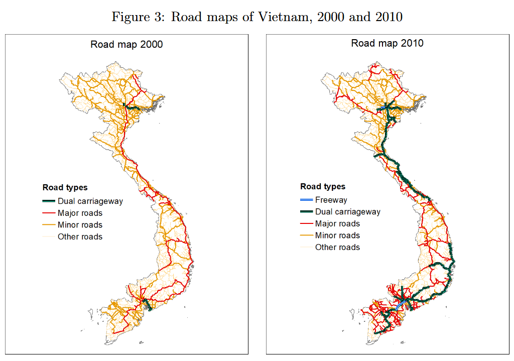

```{r libraries, include=FALSE}
# load in libraries
library(tidyverse)
library(spData)
library(sf)
library(patchwork)
```

# Assignment 

<u> **Goal** </u>: Recreate **Figure 3**: *Vietnam's Road Infrastructure by Road Type*, from the paper: 

  - Balboni, C.A., 2021. *In Harm's Way? Infrastructure Investments and the Persistence of                                Coastal Cities.* [Paper](https://economics.mit.edu/sites/default/files/publications/Catastrophe_Risk_and_Settlement_Location.pdf)

## Reference

Attached is the figure we are attempting to replicate:



## 2000 Map

### Vietnam Map

Below is a blank map of Vietnam, filtered from the 'world' dataset from the `spData` library, which uses WRS 84 coding for its CRS (projection type). Thus, we need to make sure our road data sets match this projection type (or we change Vietnam to their projection type).

```{r vietnam map}
# World Map filtered for Vietnam
sf.vietnam <- world %>% 
  filter(name_long == "Vietnam")

# Empty Vietnam Map, sanity check
ggplot() +
  geom_sf(data=sf.vietnam)
```

### Data Source 1: DIVA

[Data Source](https://diva-gis.org/data.html) 

```{r data}
rm(list=ls())
roads <- st_read("VNM_roads/VNM_roads.shp")
```

Note that the DIVA data matches our Vietnam map CRS, both using WGS 84. Hence, we do not need to worry about homogenizing our projection types.

### Road Types

```{r diva road types}
# Check for available road types in data
roads %>% 
  pull(RTT_DESCRI) %>% 
  unique()
```

We see that the only road types this data set provides are the following:

  - Primary Routes
  - Secondary Routes
  - Other
  
We will map these to the following, in respective order:

  - Major roads
  - Minors roads
  - Others
  
We are unable to include Dual Carriageways as in the 2000 figure, however, this decision is justified since there is very little Dual Carriageways in this figure to begin with; further, it is very difficult to find any road data on Vietnam in the first place, let alone across different time periods. Thus, Dual Carriageways is excluded for sake of best replicating the 2000 map with available data.

### Intersections & Plot

``` {r diva intersection}
# Intersection of roads (lines) {first argument, important!} with Vietnam (polygon) to clip any overlapping roads
sf.vietroads2 <- st_intersection(roads, sf.vietnam)

# Rename labels to match graphic, declare road type as factor variable
sf.vietroads2 <- sf.vietroads2 %>%
  mutate(RTT_DESCRI = ifelse(RTT_DESCRI == "Unknown" | is.na(RTT_DESCRI), "Other", RTT_DESCRI)) %>%
  mutate(RTT_DESCRI = factor(RTT_DESCRI, levels = c("Primary Route",
                                                    "Secondary Route",
                                                    "Other"),
                             labels = c("Major Roads", "Minor Roads", "Other Roads")))
# sanity check
levels(sf.vietroads2$RTT_DESCRI)

# set line widths & colors to match graphic
line_widths <- c(0.55,
                0.405,
                0.35)
color_palette <- c("red",
                   "darkgoldenrod2",
                   "khaki2")


# plot, store
p1 <- ggplot() +
  geom_sf(data=sf.vietnam, fill="white") +
  geom_sf(data=sf.vietroads2, 
          aes(color = RTT_DESCRI,
              linewidth = RTT_DESCRI),
          key_glyph = draw_key_path) +
  scale_color_manual(values = color_palette, 
                     name = "Road Types") +
  scale_linewidth_manual(values = line_widths,
                         name = "Road Types") +
  theme_minimal() +
  labs(title = "Road Map 2000")

p1

# clear environment (lots of memory stored)
rm(sf.vietroads2)

```

## 2010 Map

### Data Source 2: OSM

Thanks to OpenSourceMap community for contributing to the immense dataset that made this map possible. Reference to documentation can be found [here](https://wiki.openstreetmap.org/wiki/Vietnam_Mapping_Guide).

```{r osm data}
# Read in data
sf.viet_osm <- st_read("viet_osm.shp/gis_osm_roads_free_1.shp")
```

Note that the OSM data also matches our Vietnam map CRS, both using WGS 84. Hence, we do not need to worry about homogenizing our projection types.

### Road Types

```{r osm road types}
# Check all possible road types
sf.viet_osm %>% 
  pull(fclass) %>% 
  unique()
```

As we can see, this dataset contains many more possible road types than our previous one. Thus, we will use this dataset to try and replicate the 2010 plot more closely.

To replicate 2010, we need the following road types:

  - **Freeway**
  - **Dual Carriageway**
  - **Major roads**
  - **Minor roads**
  - **Other roads**
  
After referencing the OpenStreetMap wiki for documentation, it seems like the closest matches to these types are the following, in order:
  
  | | |
|:--- |:--- |
| **Motorway** | "Expressways or freeways..." |
| **Trunk** | "Large main roads leading to big cites, or the largest arterial roads inside a big                 city (but not motorways), often with multiple lanes... National Routes." |
| **Primary** | "Main arterial roads in cities... Smaller national routes, connecting smaller                      provinces or two provinces only..." |
| **Secondary** | "Main roads in one district, or roads connecting one or two urban districts                        together, and NOT the main arterial of that city. Provincial Routes." |
| **Tertiary** | "The only one main road connecting a commune to the other... One road that                         connects several residential roads together." |

### Intersections & Plot (2)

```{r osm plot 1}
sf.viet_osm1 <- sf.viet_osm %>% 
  filter(fclass %in% c("motorway",            # Freeway
                       "trunk", "trunk_link", # Dual-Carriageway
                       "primary",             # Major
                       "secondary",           # Minor
                       "tertiary"))   %>%     # Other
  mutate(fclass = factor(fclass, 
                         levels = c("tertiary", "secondary", "primary",
                                    "trunk_link", "trunk", "motorway"),
                         labels = c("Other Roads", "Minor Roads", "Major Roads",
                                    "Dual Carriageway", "Dual Carriageway", "Freeway")))
# sanity check
levels(sf.viet_osm1$fclass)

sf.viet_roads_osm1 <- st_intersection(sf.viet_osm1, sf.vietnam)

color_palette <- c("khaki2",
                   "darkgoldenrod2",
                   "red",
                   "forestgreen",
                   "blue")
line_widths <- c(0.485, 0.55, 0.55, 0.75, 0.95)

p0 <- ggplot() +
  geom_sf(data=sf.vietnam) +
  geom_sf(data=sf.viet_roads_osm1,
          aes(color = fclass,
              linewidth = fclass),
          key_glyph = draw_key_path) +
  scale_color_manual(values = color_palette,
                     name = "Road Types") +
  scale_linewidth_manual(values = line_widths,
                         name = "Road Types") +
  theme_minimal()

rm(sf.viet_roads_osm1)
rm(sf.viet_osm1)

p0
```


Our initial graph looks overcrowded, and it seems like the most accurate 1:1 replication strategy is changing:

  - Freeway -> dual carriageway, 
  - dual -> major, 
  - major -> minor, 
  - minor -> other
  
I.e. moving all our road types down a level.

### Intersections & Plot (2)

``` {r osm plot 2}
sf.viet_osm2 <- sf.viet_osm %>% 
  filter(fclass %in% c("motorway",            # Dual
                       "trunk", "trunk_link", # Major
                       "primary",             # Minor
                       "secondary"))   %>%    # Other
  mutate(fclass = factor(fclass, 
                         levels = c("motorway", "trunk", "trunk_link", 
                                    "primary", "secondary"),
                         labels = c("Dual Carriageway", "Major Roads", "Minor Roads", 
                                    "Minor Roads", "Other Roads")))
rm(sf.viet_osm)
# sanity check
levels(sf.viet_osm2$fclass)

sf.viet_roads_osm2 <- st_intersection(sf.viet_osm2, sf.vietnam)

color_palette1 <- c("forestgreen", 
                   "red", 
                   "darkgoldenrod2", 
                   "khaki2")

line_widths1 <- c(0.95, 
                 0.505, 
                 0.505, 
                 0.485)

p2 <- ggplot() +
  geom_sf(data=sf.vietnam, fill="white") +
  geom_sf(data=sf.viet_roads_osm2,
          aes(color = fclass,
              linewidth = fclass),
          key_glyph = draw_key_path) +
  scale_color_manual(values = color_palette1,
                     name = "Road Types") +
  scale_linewidth_manual(values = line_widths1,
                         name = "Road Types") +
  theme_minimal() +
  labs(title = "Road Map 2010")

p2

```

Our resulting graph looks much more similar to our 2010 figure than it did before; thus, we are done with our plots. All thats left is some cleaning of the actual figures themselves to match formatting with the figures from the paper.

## Results

Replicated results:

```{r final plots, out.width = "100%"}
# Adust plots to match outline, remove gridlines, axis ticks, etc.
p1 <- p1 +
  theme(
    plot.background = element_rect(color = "black", fill = NA, linewidth = 0.8),
    panel.grid.major = element_blank(),
    panel.grid.minor = element_blank(),
    axis.text = element_blank(),
    axis.ticks = element_blank(),
    axis.title = element_blank(),
    legend.key = element_rect(fill = NA, color = NA),
    legend.background = element_blank(),
    legend.text = element_text(size = 7),      
    legend.title = element_text(size = 8, face = "bold"),     
    legend.key.size = unit(0.5, "cm"),
    plot.title = element_text(size = 9, margin = margin(b = 10), hjust = 1.5),
  )

p2 <- p2 +
    theme(
    plot.background = element_rect(color = "black", fill = NA, linewidth = 0.8),
    panel.grid.major = element_blank(),
    panel.grid.minor = element_blank(),
    axis.text = element_blank(),
    axis.ticks = element_blank(),
    axis.title = element_blank(),
    legend.key = element_rect(fill = NA, color = NA),
    legend.background = element_blank(),
    legend.text = element_text(size = 7),      
    legend.title = element_text(size = 8, face = "bold"),    
    legend.key.size = unit(0.5, "cm"),
    plot.title = element_text(size = 9, margin = margin(b = 10), hjust = 1.5),
  )

# final results: side by side
p1 + p2
```

Original figure:


### Observations

We notice that the graphs seems to look quite similar, although not exact 1:1 replications. This is to be expected for a couple of reasons:

  1. The figures were not generated from pre-existing data sources like gROADS or DIVA -- rather, the author Badboni generated her figure manually by, quote:
  
      - "...obtain[ing] road network data from the 2000 and 2010 editions of ITMB Publishing’s           detailed International Travel Maps of Vietnam, which show the location of freeways,             dual carriageways, major, 47 minor and other roads. (By) geo-referenc[ing] each map and          manually trac[ing] the location of each road category to obtain a GIS shapefile of the          entire road network in each road category in 2000 and 2010..."
      
  2. Detailed data on Vietnam road types is not widely available. There exists road data, but        the roads are not always labeled precisely; further, even when there is existing data with      plenty of labels for the road types, the data is much more recent (OSM, for example);           thus, it will not match with road structure from 2000 or 2010 1:1, which is to be expected.
  
That being said, we're quite happy with the results in lieu of access to the generated data.
