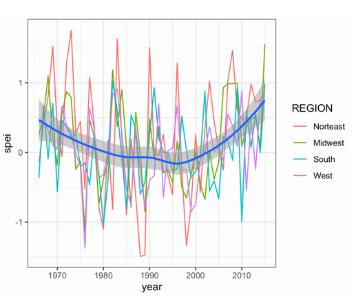
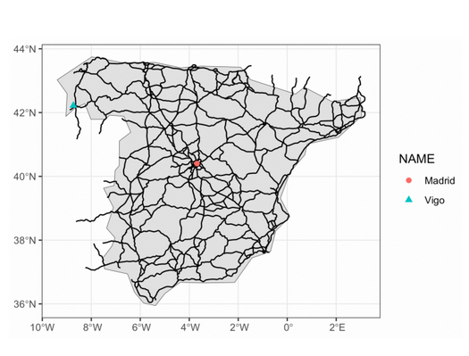
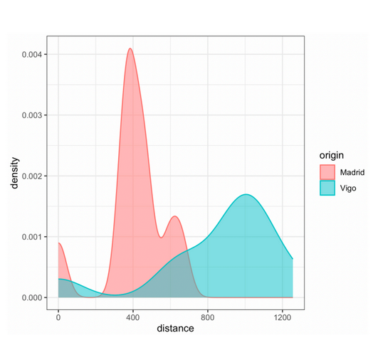

```{r libraries, output='hide'}
# load in libraries
rm(list=ls())
library(terra)         # raster operations
library(exactextractr) # exact_extract() for distances
library(gdistance)     # fast distance() formula for geo data
library(sf)            # vector operations
library(spData)        # geo data
library(tidyverse)     # NOTE: Conflict -- tidyr::extract() masks terra::extract()
library(glue)          # printf() syntax
library(spDataLarge)   # geo data
library(ggrepel)       # add labels to ggplot
library(tidyterra)     # visualize geospatial using tidy syntax
library(patchwork)     # patch tg ggplot objects
```

# Assignment 

<u> **Goal** </u>: Model the following: 

  1. [Climate Change in the USA](#sec-droughts)
  2. [Transportation Isolation & Centrality in Spain](#sec-transportation)
  
# Part 1: Climate Change {#sec-droughts}

## Task

Calculating climate change in USA 

  * Use the us_states data on the geography of US states 
  * Retrieve average SPEI index across regions for the past 50 years 
  * Retrieve the dataset as a panel (time series for each region) 
  * Plot the evolution of the SPEI index for each region 
    * geom_smooth(): calculate the average across regions
  
## Reference

Attached is the figure we are attempting to replicate qualitatively (not identically):

::: {#fig-droughts layout-ncol=1}


SPEI Drought Index: USA
:::

## Data Source 1: SPEI Drought Index

[Data Source](https://spei.csic.es/database.html) 

```{r data1}
drought <- rast("data/spei01.nc")
drought # inspect
```

Note that the data is multilayer (also indicated by the *.nc file type); there are `nlyr(drought)` different subsections, corresponding to monthly data from 1950-01-01 to 2025-10-01.

```{r}

```


# Part 2: Transportation {#sec-transportation}

## Task

Visualizing transportation centrality and isolation across Spain

  * Use the ne_10m_populated_places shapefile to retrieve the top-10 populated places
  * Crop the ne_10m_roads data within Spain 
  * Build a raster/friction surface; calculate distances between all city pairs
  * Bilateral distances if coming from Madrid vs. Vigo: who is more isolated?
    * geom_density(): calculates "smoothed" distributions

## Reference

Attached are the figures we are attempting to replicate qualitatively (not identically):

::: {#fig-droughts layout-ncol=2}





Transportation and Isolation in Spain: Madrid vs Vigo
:::

## Data Source 1: Natural Earth

[Data Source](https://www.naturalearthdata.com/downloads/10m-cultural-vectors/)

```{r ne data, output='hide'}
sf.roads <- st_read("data/ne_10m_roads/ne_10m_roads.shp")
sf.cities <- st_read("data/ne_10m_populated_places/ne_10m_populated_places.shp")
sf.spain <- spData::world %>% 
  filter(name_long == "Spain")
```

::: {.callout-tip}
## Projection

All three of sf.roads, sf.cities, and sf.spain share the same projection style WGS84, so there is no need to recast any of them.
:::

### 2.1: Roads Map

#### Filter Populated Cities

First, we want to filter for the top 10 most populated cities in Spain

```{r spain cities, warning=FALSE, message=FALSE}
sf.cities_spain10 <- sf.cities %>% 
  filter(ADM0NAME == "Spain") %>% 
  select(NAME, POP_MAX, geometry) %>% 
  arrange(desc(POP_MAX)) %>% 
  slice(1:10)
```


```{r spain cities plot and table}
#| code-fold: true

# sanity check
ggplot() +
  geom_sf(data=sf.spain) +
  geom_sf(data=sf.cities_spain10, 
          aes(size = POP_MAX, 
              color = NAME)) +
  geom_text_repel(data = sf.cities_spain10, 
                  aes(label = NAME, geometry = geometry),
                  stat = "sf_coordinates", 
                  size = 3, fontface = 'bold') +
  labs(title = "Top 10 Most Populated Cities in Spain") +
  theme_void() +
  theme(legend.position = 'none',
        plot.title = element_text(hjust=0.5))

# table of populations
sf.cities_spain10 %>% 
  st_drop_geometry() %>% 
  rename(City = NAME,
         Population = POP_MAX)
```


:::{.callout-note}
Note that our final map only cares about Madrid and Vigo, but we need the top 10 most populated cities to calculate distances between cities. We will drop them once we move onto the final map recreation.
:::

#### Crop Spain Roads

Next, we will crop the world road data to just be contained within Spain, using the vector operations `sf::st_intersection()`

```{r roads, warning=FALSE, message=FALSE}
# filter for roads in spain
sf.roads_spain <- st_intersection(sf.roads, sf.spain)

# sanity check
ggplot() +
  geom_sf(data=sf.spain) +
  geom_sf(data=sf.roads_spain) + 
  geom_sf(data=sf.cities_spain10, 
          aes(size = POP_MAX, 
              color = NAME)) +
  geom_text_repel(data = sf.cities_spain10, 
                  aes(label = NAME, geometry = geometry),
                  stat = "sf_coordinates", 
                  size = 3, fontface = 'bold') +
  labs(title = "Top 10 Most Populated Cities in Spain") +
  theme_void() +
  theme(legend.position = 'none',
        plot.title = element_text(hjust=0.5))
```

#### Raster Template

To calculate distances between all city pairs, we must create a raster surface, cropped to fit the bounds of our `sf.spain` vector object.

```{r raster friction}
r.template <- rast()
values(r.template) <- runif(1:ncell(r.template))

# crop to spain bounds
r.template <- terra::crop(r.template, sf.spain)

# sanity check
plot(r.template)
```

Note that our resolution is only `res(r.spain)` with size equal to `size(r.spain)`, meaning we only have 96 total gridcells, coming from the fact that cropping our raster object basically just 'zoomed in' form our 64800 world size to fit our Spain map.

To make our calculations more precise, we want to redefine this resolution. Note that we also will adjust the cropping to give the map a bit of 'breathing room', as sometimes `terra::crop()` can cut off edges of the map.

```{r resolution fix}
ext(r.template) <- c(-10, 4, 35.5, 44) # manually cropping
res(r.template) <- 0.05                # set res to much finer for more precision
values(r.template) <- runif(1:ncell(r.template))

# sanity check
plot(r.template)
plot(st_geometry(sf.spain), add=T, col=adjustcolor("gray", alpha.f=0.8))
```

#### Rasterize

Now we can find the sf.cities_spain10 multipoints that intersect with our r.spain raster gridcells to calculate distances from one another. To do so, we first must rasterize our sf.spain vector object, using the newly created raster template.

```{r rasterize spain}
r.spain <- terra::rasterize(x=sf.spain,    # vector object
                            y=r.template,  # template raster
                            field = 1)     # optional: set touching vals = 1

# cells on the network = 1, off-network = NA
plot(r.spain, main = "Rasterized Spain Map")
plot(st_geometry(sf.spain), add = TRUE) 
```

The map seems to almost perfectly rasterize the sf.spain polygon, contained within the borders outlined by the vector object. Next, we must convert this rasterized object into a transition matrix such that we can perform matrix operation on it. We do so using the `gdistance::transition()` function.

#### Transition Matrix

:::{.callout-warning}
Since the `transition()` function comes from the `gdistance` library, we need to make sure our raster object is a RasterLayer, not a SpatRaster object from the `terra` library. We convert this type before passing in our filled out r.spain raster object into the transition matrix function.
:::

```{r}
# convert NA values to 0 to compute distances later on
r.spain_filled <- r.spain
r.spain_filled[is.na(r.spain_filled)] <- 0 # replace NA values with 0

# convert: SpatRaster -> RasterLayer
r.spain_filled <- raster::raster(r.spain_filled)

# transition matrix
trans <- gdistance::transition(
  x = r.spain_filled,             # must be a gdistance::RasterLayer object
  transitionFunction = mean,   
  directions = 8                  # max 8-gridcells surrounding any given gridcell
)
```

:::{.callout-note}
We must convert the NA values to become 0. That way, any distance operations do not fail (when we pass NA) and only matter for non-zero integers. We do this using the `is.na()` function called onto our newly rasterized r.spain object.
:::

Note that after we build the matrix, we must correct for diagonal distances, as in a grid, the distance between two horizontally or vertically adjacent cells is 1 cell width. But the distance between two diagonally adjacent cells is $\sqrt{2} \approx 1.414$ cell widths. Without correction, the algorithm treats both as equal cost.

```{r correct diags}
# correct for diagonal distances (geometric correction)
trans_corrected <- geoCorrection(trans, type = "c")
```

::: {.callout-important}
Without `geoCorrection()`, a path that moves diagonally across 10 cells would appear to cost the same as one moving cardinally across 10 cells, even though the diagonal path is actually $ \sim 41\%$ longer in real space. This means the algorithm would prefer diagonal movement, producing paths that snake diagonally rather than following the true network geometry. The correction scales each edge weight by the actual geographic distance between cell centers.
:::

#### Distances between Cities

To calculate distances between points, we use the `gdistance::shortestpath()` function, which employs a 'minimum-cost' ([Dijkstra](https://en.wikipedia.org/wiki/Dijkstra%27s_algorithm)) pathfinding algorithm. 
  
Importantly, we must select a start and end point in our raster object for the algorithm to calculate the shortest path between. We will select these points as the 10 city geometries, and run them through a loop to retrieve every possible city-pair distance.

```{r spain city distances}
cities <- sf.cities_spain10$NAME                      # extract city names
city_geoms <- st_geometry(sf.cities_spain10)          # extract city geoms
city_pairs <- matrix(data = NA, nrow = 10, ncol = 10,
                     dimnames = list(cities, cities)) # initialize empty matrix of dist
city_paths <- list()                                  # init empty list to store paths

# loop
for (i in 1:10) {
  for (j in 1:10) {
    if (i == j) {
      city_pairs[i, j] <- 0  # distance to itself
    } else {
      path <- gdistance::shortestPath(
        x     = trans_corrected,
        origin  = as(city_geoms[i], "Spatial"),
        goal    = as(city_geoms[j], "Spatial"),
        output  = "SpatialLines"
      )
      city_pairs[i, j] <- SpatialLinesLengths(path, longlat = TRUE)
      city_paths[[paste(cities[i], cities[j], sep = "_")]] <- path  # store path
    }
  }
}

# table results
city_pairs
```

Here, we can visualize the shortest distances between Madrid and the other 9 largest cities in Spain, and vice-versa for Vigo.

:::{.callout-important}
One might expect for the shortest distance between two cities to be a straight line; however, note that the `shortestpath()` function is calculated based on our non-zero gridcells. If we increase the precision by decreasing the resolution further, we would likely see straighter and straighter lines connecting the cities. This however, comes at a cost of more computational power. Since our goal is not about paths between cities, we will not concern ourselves with such a level of precision.
:::

```{r shortest paths, warning=FALSE, message=FALSE}
#| code-fold: true

madrid_paths_sf <- lapply(city_paths[grep("^Madrid_", 
                                          names(city_paths))], 
                          st_as_sf) %>%
  bind_rows() %>% 
  st_set_crs(st_crs(sf.cities_spain10))

# madrid plot
p1<-ggplot() +
  geom_sf(data=sf.spain) +
  geom_sf(data = madrid_paths_sf, color = "blue") +
  geom_sf(data=sf.cities_spain10, 
          aes(size = POP_MAX, 
              color = NAME)) +
  geom_text_repel(data = sf.cities_spain10, 
                  aes(label = NAME, geometry = geometry),
                  stat = "sf_coordinates", 
                  size = 3, fontface = 'bold') +
  labs(title = "Shortest Path from Madrid") +
  theme_void() +
  theme(legend.position = 'none',
        plot.title = element_text(hjust=0.5))

vigo_paths_sf <- lapply(city_paths[grep("^Vigo_", 
                                          names(city_paths))], 
                          st_as_sf) %>%
  bind_rows() %>% 
  st_set_crs(st_crs(sf.cities_spain10))

# vigo plot
p2<-ggplot() +
  geom_sf(data=sf.spain) +
  geom_sf(data = vigo_paths_sf, color = "red") +
  geom_sf(data=sf.cities_spain10, 
          aes(size = POP_MAX, 
              color = NAME)) +
  geom_text_repel(data = sf.cities_spain10, 
                  aes(label = NAME, geometry = geometry),
                  stat = "sf_coordinates", 
                  size = 3, fontface = 'bold') +
  labs(title = "Shortest Path from Vigo") +
  theme_void() +
  theme(legend.position = 'none',
        plot.title = element_text(hjust=0.5))

p1+p2
```

#### Final Graph

Finally, to replicate @fig-droughts (a), we will isolate only Madrid and Vigo, and adjust our previous roads element to extend outside of the Spanish borders by using a 50km buffer.

```{r, warning=FALSE, message=FALSE}
sf_cities_spain2 <- sf.cities_spain10 %>% 
  filter(NAME == "Madrid" | NAME == "Vigo")

sf.roads_spain2 <- sf.roads %>%
  filter(featurecla == "Road") %>%                     # filter out boat travel (ferries)
  st_filter(sf.spain, .predicate = st_intersects) %>%  # keep only roads that touch Spain
  st_simplify(dTolerance = 500)                        # simplify the roads slightly to match

ggplot() +
  geom_sf(data=sf.spain) +
  geom_sf(data=sf.roads_spain2, lwd=0.75) + 
  geom_sf(data=sf_cities_spain2, 
          aes(color = NAME, shape = NAME), size = 2.5) +
  scale_shape_manual(values = c("Madrid" = 16, "Vigo" = 17)) +
  theme_bw() +
  theme(plot.title = element_text(hjust=0.5))
```

Our resulting plot looks to be nearly 1-1 mapping qualitatively to the reference photo:


### 2.2: Densities Graph

Thanks to our city-pair distance matrix we created earlier, we can easily create our final graph based on the distances between cities:

```{r city dist density}
df <- data.frame(
  distance = c(as.numeric(city_pairs['Madrid', ]), as.numeric(city_pairs['Vigo', ])),
  city = rep(c("Madrid", "Vigo"), each = ncol(city_pairs) )
)

ggplot(df, aes(x = distance, 
               fill = city,
               color=city)) +
  geom_density(alpha = 0.5, lwd=0.75) +
  labs(fill = "origin",
       color = "origin") +
  scale_x_continuous(breaks = c(400, 800, 1200), limits = c(0, 1250)) + 
  theme_bw()
```

Compared to our reference photo:


  